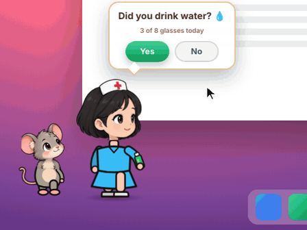
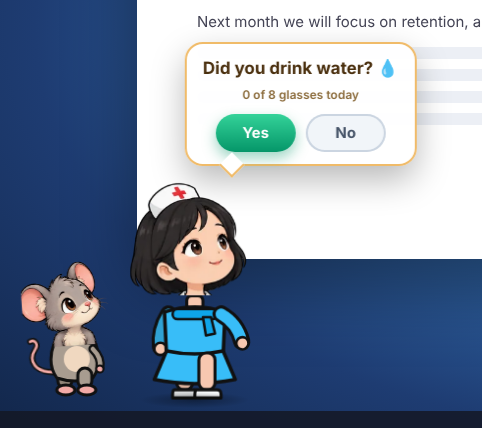
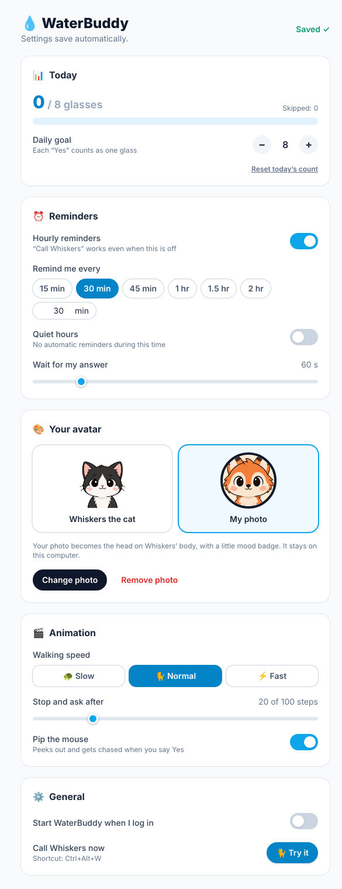
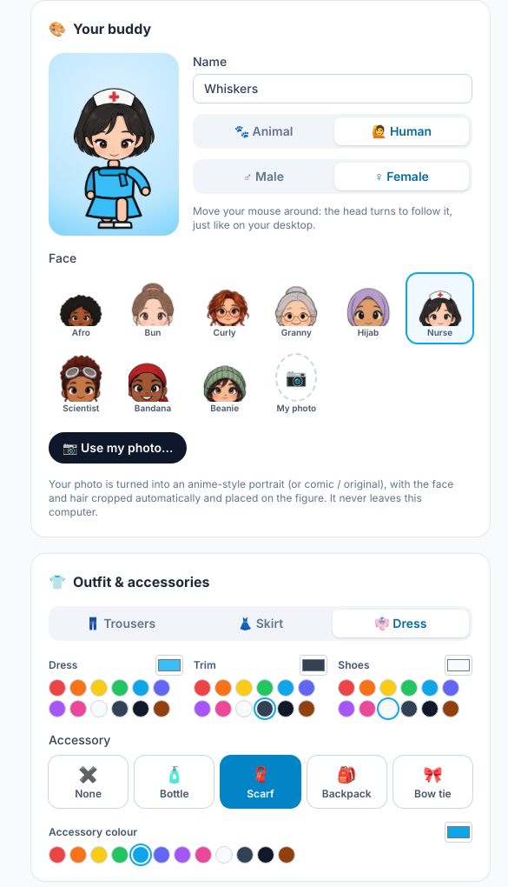

<div align="center">

# 💧 WaterBuddy

**Your own animated buddy — an animal, a person, or *you* in anime style — who makes sure you drink water.**


<sub>Every hour, Whiskers walks in and asks if you've had water. Say <b>Yes</b> and the chase is on!</sub>

[](https://github.com/gyuv16/Need-Waterbottle/actions/workflows/build.yml)


[**Download**](https://github.com/gyuv16/Need-Waterbottle/releases/latest) · [Meet the cast](#meet-the-cast) · [How it works](#how-it-works) · [Settings](#settings--your-own-avatar) · [Screenshots](#screenshots) · [FAQ](#faq)

</div>

---

## Meet the cast

<p align="center">
  
</p>

| | |
|---|---|
| 🐈 **Whiskers** | A chibi black-and-white tuxedo cat with white socks and a swishy tail. Whiskers' face changes with the story: curious while walking, wide-eyed when asking, star-struck during the chase and downcast when you say No. |
| 🐁 **Pip** | A little grey mouse with big pink ears. Pip peeks out curiously, then laughs all the way through the chase. |

## Make it yours

<table>
  <tr>
    <td align="center" valign="top" width="50%"><br><sub><b>Real head turns</b>: the head turns through nine directions and follows your pointer</sub></td>
    <td align="center" valign="top" width="50%"><br><sub><b>Human or animal</b>: choose the face, outfit colours and accessories</sub></td>
  </tr>
</table>

- **🐾 Animal or 🙋 Human.** Pick from 12 animals (cat, pug, bear, bunny, fox, panda, penguin, tiger, koala, raccoon, red panda, hamster) or a person. Choose **Male** or **Female**, then one of 17 faces (beard, cap, turban, chef, curly, hijab, nurse, beanie and more).
- **📷 Your photo becomes the face.** Upload any photo. The face and hair are found and cropped automatically, then turned into an **anime-style portrait**: smooth painted skin, cel shading, clean ink lines and a soft glow. You can pick **Comic** or **Original** instead, and drag or zoom to fine-tune.
- **👕 Outfits and accessories.** Trousers, skirt or dress, each in any colour, plus shoes. Add a water bottle, scarf, backpack or bow tie in any colour.
- **👀 A head that really turns.** Walking in, your buddy looks where it's going. When it stops, it turns to face you, then follows your mouse pointer through nine directions, stepping through the in-between angles like a hand-drawn animation.
- **✏️ A name.** Give your buddy a name. The menu says **Call Nina 🙋**, for example.

## How it works

<p align="center">
  
</p>

1. **Whiskers walks in.** Every hour, Whiskers strolls in from the left edge of your screen. The walk is split into 100 steps.
2. **The question.** After 20 steps, Whiskers stops, and a bubble pops up above Whiskers' head: **"Did you drink water?"** with **Yes** and **No** buttons. Pip peeks out from behind Whiskers and waits for your answer.
3. **Yes: the chase!** Pip dashes off to the right, and Whiskers chases after Pip at full speed until they're both off the screen.
4. **No: a sad walk home.** Whiskers' ears droop and a tear falls. Whiskers turns around and walks slowly back to the left. If you don't answer within a minute, Whiskers heads home the same way.

Only the two buttons can be clicked. Everywhere else, your clicks and typing go straight to whatever you're working on.

### If you say No

<p align="center">
  
</p>

## Settings & your own avatar

Open **💧 → Settings…** from the menu bar (Mac) or system tray (Windows).

<table>
  <tr>
    <td align="center" valign="top"></td>
    <td valign="top">

**📊 Today**: see how many glasses you've had, set a daily goal (each **Yes** counts as one glass) and reset the count.

**⏰ Reminders**: turn the reminders on or off, and choose how often they come (15 minutes to 2 hours, or any number of minutes). You can also set **quiet hours** (for example 10 PM–8 AM) and how long Whiskers waits for your answer.

**🎨 Your buddy**: name, Animal / Human, Male / Female, face style, or **your own photo**, turned into an anime portrait and cropped to face and hair automatically. A live preview follows your pointer.

**👕 Outfit & accessories**: trousers / skirt / dress, top, bottom and shoe colours, plus a bottle, scarf, backpack or bow tie in any colour.

**🎬 Animation**: walking speed (slow / normal / fast), when Whiskers stops to ask (step 10–60 of 100), and Pip the mouse on or off.

**⚙️ General**: start WaterBuddy when you log in, and a **🐈 Try it** button to call Whiskers right away.



</td>
  </tr>
</table>

Settings save automatically and apply right away.

## 🧊 3D anime avatar & desktop pet

Pick **🧊 3D anime** in *Your buddy* and import any `.vrm` model (for example one you made for free in **VRoid Studio**). Your 3D character then:

- walks in, turns to face you and talks while it asks, waves and runs off when you say **Yes**, and walks home sadly when you say **No**;
- turns its whole body smoothly, blinks, breathes, and follows your pointer with its head and eyes;
- has hair and clothes that sway as it moves;
- can wave, look surprised, think, and show joy, sorrow, anger and more (try them in the live preview).

Turn on **Desktop pet** and it wanders around the bottom of your screen between reminders, stopping now and then to wave or think, and jumps back in surprise if you dash the pointer at it. The 3D engine only loads when you use a 3D avatar, so the default buddy stays light.

Want to build or tune your own model? See the [3D avatar guide](docs/VRM_GUIDE.md).

## ✨ AI anime avatar (upload your own photo)

In *Your buddy*, press **✨ AI anime avatar…**, upload your photo and press **Generate**. The ready-made prompt turns you into a cute, high-quality anime character with your facial structure and hairstyle, a modern tech-wear outfit, hair accessories, subtle jewellery and vibrant anime lighting. You can edit the prompt freely. Press **Use as my face →** to crop the result to face and hair and put it on your buddy.

- It uses **your own OpenAI API key** (image model `gpt-image-1`); each image is billed to your OpenAI account.
- The key is stored encrypted on your computer (or kept only until you quit, if the system has no secure storage). You can remove it any time.
- 🔒 Your photo leaves your computer **only** when you press Generate, and only goes to OpenAI.

## Screenshots

<table>
  <tr>
    <td align="center"><br><sub><b>macOS</b>: Whiskers asks the question</sub></td>
    <td align="center"><br><sub><b>Windows</b>: the sad walk home after "No"</sub></td>
  </tr>
</table>

<sub>Captured from the running app and placed on sample desktops.</sub>

## Features

| | |
|---|---|
| 🐈 **Animated story** | A cat-and-mouse reminder that plays out on your desktop every hour |
| ✅ **Yes / No answer** | Tell Whiskers whether you've had water, and get a happy chase or a sad goodbye |
| 🖱️ **Never in the way** | Only the two buttons are clickable; everything else clicks straight through |
| 🖥️ **Always visible** | Appears over full-screen apps and on every virtual desktop or Space |
| 👻 **Invisible otherwise** | No window, no taskbar button, no Dock icon |
| 🐈 **Call Whiskers** | Call the cat any time from the 💧 menu-bar / tray icon, or press **⌘⌥W** (Mac) / **Ctrl+Alt+W** (Windows) |
| ♿ **Reduced motion** | Respects your system's reduce-motion setting |
| 🙋 **Human or animal** | 12 animals or 17 human faces (male / female), with outfits and accessories in any colour |
| 🌸 **Anime photo face** | Your photo, auto-cropped to face and hair and turned into an anime-style portrait |
| 👀 **Real head turns** | Nine head directions; the head follows your mouse pointer |
| 📊 **Daily goal** | Counts your glasses each day and shows progress in the bubble and the tray menu |
| 🌙 **Quiet hours** | No reminders during the hours you choose |
| 🪶 **Lightweight** | The overlay is hidden between reminders: about 0.1% CPU while idle |
| 💻 **Cross-platform** | Windows 10/11, plus macOS on Apple Silicon and Intel |

## Download & install

Get the latest version from the [**Releases page**](https://github.com/gyuv16/Need-Waterbottle/releases/latest).

| Your computer | Download |
|---|---|
| Windows 10 / 11 | [**⬇ WaterBuddySetup.exe**](https://github.com/gyuv16/Need-Waterbottle/releases/latest/download/WaterBuddySetup.exe) |
| Mac with Apple Silicon (M1, M2, M3, M4) | [**⬇ WaterBuddy-arm64.dmg**](https://github.com/gyuv16/Need-Waterbottle/releases/latest/download/WaterBuddy-arm64.dmg) |
| Mac with Intel | [**⬇ WaterBuddy-x64.dmg**](https://github.com/gyuv16/Need-Waterbottle/releases/latest/download/WaterBuddy-x64.dmg) |

<details>
<summary><b>Windows</b></summary>

1. Run `WaterBuddySetup.exe`.
2. If **Windows protected your PC** appears, click **More info → Run anyway**.
3. WaterBuddy installs and starts automatically. Look for the 💧 icon in the system tray.
</details>

<details>
<summary><b>macOS</b></summary>

1. Open the `.dmg` and drag **WaterBuddy** into **Applications**.
2. The first time, **right-click** WaterBuddy in Applications and choose **Open**, then confirm.
3. Look for the 💧 icon in the menu bar.

Not sure which Mac you have? Click  → **About This Mac**. If **Chip** says *Apple M…*, download `arm64`. If it says **Processor … Intel**, download `x64`.
</details>

## Using WaterBuddy

- **Start:** it starts after installation. To start it again later, open WaterBuddy from the Start menu or the Applications folder.
- **Reminders:** Whiskers visits once every hour.
- **Call Whiskers any time:**
  - **Mac:** click the 💧 icon in the menu bar at the top of the screen → **Call Whiskers 🐈**, or press **⌘⌥W**.
  - **Windows:** click the 💧 icon in the system tray, or press **Ctrl+Alt+W**. Right-click the icon for the menu.
- **Answer:** click **Yes** or **No** in Whiskers' speech bubble. With no answer in time (60 seconds unless you change it), Whiskers walks home.
- **Settings:** 💧 icon → **Settings…**, or untick **Hourly reminders** in the same menu to pause.
- **Quit:** click the 💧 icon in the tray or menu bar → **Quit WaterBuddy**.

## FAQ

<details>
<summary><b>Will it interrupt my presentation or video call?</b></summary>
Whiskers appears on top of other windows, but only the Yes and No buttons take clicks. Everything else keeps working as normal. If you're sharing your whole screen, other people will see Whiskers too, so you may want to quit WaterBuddy before presenting.
</details>

<details>
<summary><b>Why can't I see a window or Dock icon?</b></summary>
That's intentional. WaterBuddy runs quietly in the background. Use the 💧 tray or menu-bar icon to quit it.
</details>

<details>
<summary><b>Does it collect any data?</b></summary>
No. WaterBuddy works entirely offline and sends nothing anywhere.
</details>

<details>
<summary><b>Why does my computer warn me when I install it?</b></summary>
The installers aren't code-signed yet, so Windows and macOS show a one-time warning. Follow the install steps above to continue.
</details>

---

<details>
<summary><b>Build from source</b></summary>

```bash
npm install
npm start      # preview (Whiskers appears every 10 seconds)
npm run make   # create an installer for the current OS
```

You can also create installers for Windows and both Mac types by publishing a release on GitHub. The installers are attached to the release automatically.
</details>

## Credits

All character head and expression artwork (animals, people and Pip) comes from [page-mascot](https://github.com/nilbuild/page-mascot) by Kamran Ahmed, used under the MIT License (see `src/assets/mascot/LICENSE-page-mascot`). `scripts/build_mascots.py` prepares the frames. 3D avatars use [three.js](https://threejs.org) and [three-vrm](https://github.com/pixiv/three-vrm) (MIT). The full bodies, outfits, accessories, head-turn animation and photo filters were made for WaterBuddy.

<div align="center"><sub>Stay hydrated 💧</sub></div>
