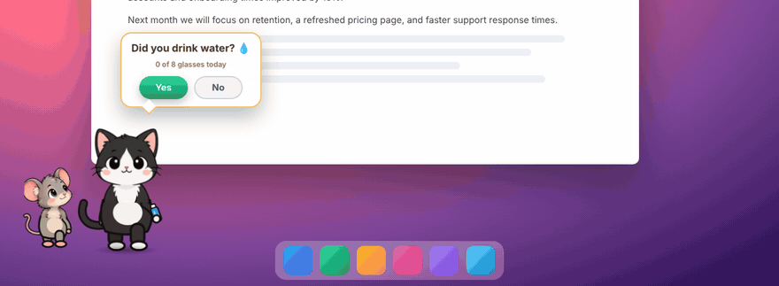
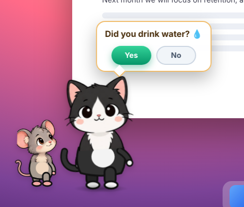
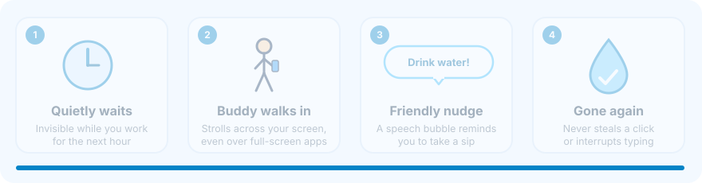
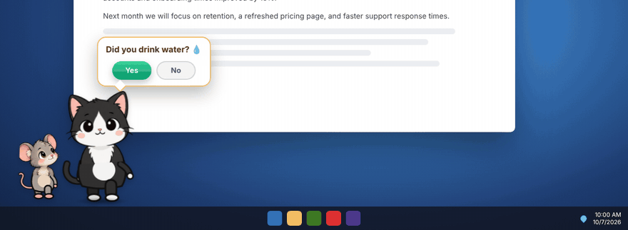
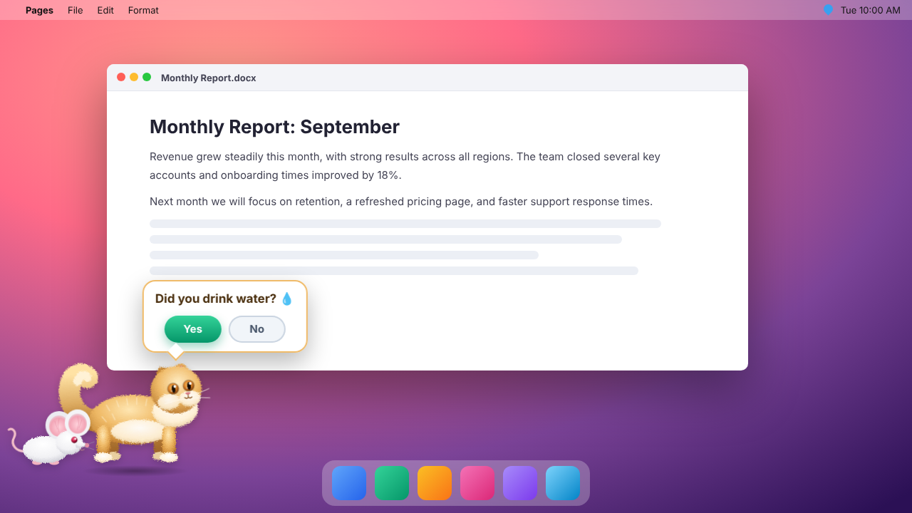
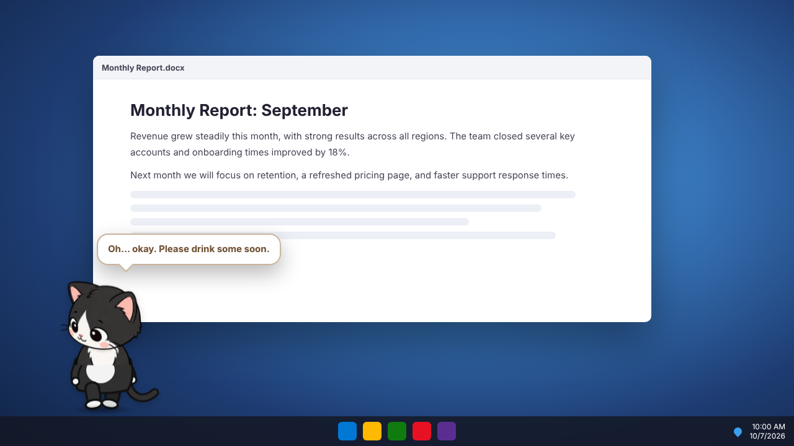

<div align="center">

# 💧 WaterBuddy

**A golden Persian cat and a little white mouse who make sure you drink water.**



<sub>Every hour, Whiskers walks in and asks if you've had water. Say <b>Yes</b> and the chase is on!</sub>

[](https://github.com/gyuv16/Need-Waterbottle/actions/workflows/build.yml)


[**Download**](https://github.com/gyuv16/Need-Waterbottle/releases/latest) · [Meet the cast](#meet-the-cast) · [How it works](#how-it-works) · [Screenshots](#screenshots) · [FAQ](#faq)

</div>

---

## Meet the cast

<p align="center">
  
</p>

| | |
|---|---|
| 🐈 **Whiskers** | A golden Persian cat with a long, flowing coat, a thick neck ruff, a plumed tail and copper eyes. Whiskers cares about your hydration. |
| 🐁 **Pip** | A tiny white mouse with big pink ears. Pip loves a good chase. |

## How it works

<p align="center">
  
</p>

1. **Whiskers walks in.** Every hour, Whiskers strolls in from the left edge of your screen. The walk is split into 100 steps.
2. **The question.** After 20 steps, Whiskers stops, and a bubble pops up above Whiskers' head: **"Did you drink water?"** with **Yes** and **No** buttons. Pip peeks out from behind Whiskers and waits for your answer.
3. **Yes: the chase!** Pip dashes off to the right, and Whiskers chases after Pip at full speed until they're both off the screen.
4. **No: a sad walk home.** Whiskers' ears droop and a tear falls. Whiskers turns around and walks slowly back to the left. If you don't answer within a minute, Whiskers heads home the same way.

Only the two buttons can be clicked. Everywhere else, your clicks and typing go straight to whatever you're working on.

### If you say No

<p align="center">
  
</p>

## Screenshots

<table>
  <tr>
    <td align="center"><br><sub><b>macOS</b>: Whiskers asks the question</sub></td>
    <td align="center"><br><sub><b>Windows</b>: the sad walk home after "No"</sub></td>
  </tr>
</table>

<sub>Captured from the running app and placed on sample desktops.</sub>

## Features

| | |
|---|---|
| 🐈 **Animated story** | A cat-and-mouse reminder that plays out on your desktop every hour |
| ✅ **Yes / No answer** | Tell Whiskers whether you've had water, and get a happy chase or a sad goodbye |
| 🖱️ **Never in the way** | Only the two buttons are clickable; everything else clicks straight through |
| 🖥️ **Always visible** | Appears over full-screen apps and on every virtual desktop or Space |
| 👻 **Invisible otherwise** | No window, no taskbar button, no Dock icon |
| 🐈 **Call Whiskers** | Call the cat any time from the 💧 menu-bar / tray icon, or press **⌘⌥W** (Mac) / **Ctrl+Alt+W** (Windows) |
| ♿ **Reduced motion** | Respects your system's reduce-motion setting |
| 💻 **Cross-platform** | Windows 10/11, plus macOS on Apple Silicon and Intel |

## Download & install

Get the latest version from the [**Releases page**](https://github.com/gyuv16/Need-Waterbottle/releases/latest).

| Your computer | Download |
|---|---|
| Windows 10 / 11 | `WaterBuddySetup.exe` |
| Mac with Apple Silicon (M1, M2, M3, M4) | `WaterBuddy-arm64.dmg` |
| Mac with Intel | `WaterBuddy-x64.dmg` |

<details>
<summary><b>Windows</b></summary>

1. Run `WaterBuddySetup.exe`.
2. If **Windows protected your PC** appears, click **More info → Run anyway**.
3. WaterBuddy installs and starts automatically. Look for the 💧 icon in the system tray.
</details>

<details>
<summary><b>macOS</b></summary>

1. Open the `.dmg` and drag **WaterBuddy** into **Applications**.
2. The first time, **right-click** WaterBuddy in Applications and choose **Open**, then confirm.
3. Look for the 💧 icon in the menu bar.

Not sure which Mac you have? Click  → **About This Mac**. If **Chip** says *Apple M…*, download `arm64`. If it says **Processor … Intel**, download `x64`.
</details>

## Using WaterBuddy

- **Start:** it starts after installation. To start it again later, open WaterBuddy from the Start menu or the Applications folder.
- **Reminders:** Whiskers visits once every hour.
- **Call Whiskers any time:**
  - **Mac:** click the 💧 icon in the menu bar at the top of the screen → **Call Whiskers 🐈**, or press **⌘⌥W**.
  - **Windows:** click the 💧 icon in the system tray, or press **Ctrl+Alt+W**. Right-click the icon for the menu.
- **Answer:** click **Yes** or **No** in Whiskers' speech bubble. With no answer within a minute, Whiskers walks home.
- **Quit:** click the 💧 icon in the tray or menu bar → **Quit WaterBuddy**.

## FAQ

<details>
<summary><b>Will it interrupt my presentation or video call?</b></summary>
Whiskers appears on top of other windows, but only the Yes and No buttons take clicks. Everything else keeps working as normal. If you're sharing your whole screen, other people will see Whiskers too, so you may want to quit WaterBuddy before presenting.
</details>

<details>
<summary><b>Why can't I see a window or Dock icon?</b></summary>
That's intentional. WaterBuddy runs quietly in the background. Use the 💧 tray or menu-bar icon to quit it.
</details>

<details>
<summary><b>Does it collect any data?</b></summary>
No. WaterBuddy works entirely offline and sends nothing anywhere.
</details>

<details>
<summary><b>Why does my computer warn me when I install it?</b></summary>
The installers aren't code-signed yet, so Windows and macOS show a one-time warning. Follow the install steps above to continue.
</details>

---

<details>
<summary><b>Build from source</b></summary>

```bash
npm install
npm start      # preview (Whiskers appears every 10 seconds)
npm run make   # create an installer for the current OS
```

You can also create installers for Windows and both Mac types by publishing a release on GitHub. The installers are attached to the release automatically.
</details>

<div align="center"><sub>Stay hydrated 💧</sub></div>
