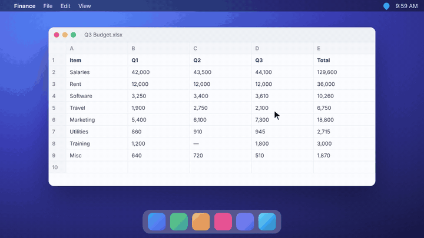
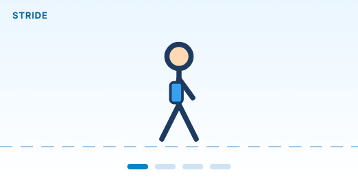

<div align="center">

# 💧 WaterBuddy

**A tiny walking companion that reminds you to drink water without interrupting your work.**



<sub>Every hour, Buddy strolls across your screen with a friendly reminder. You keep clicking and typing as usual.</sub>

[](https://github.com/gyuv16/Need-Waterbottle/actions/workflows/build.yml)


[**Download**](https://github.com/gyuv16/Need-Waterbottle/releases/latest) · [How it works](#how-it-works) · [Features](#features) · [FAQ](#faq)

</div>

---

## How it works

<p align="center">
  
</p>

1. **Quietly waits.** Once you open WaterBuddy, it stays out of sight. There's no window to manage and nothing in your taskbar or Dock.
2. **Buddy walks in.** Every hour, a little character walks onto your screen from the left. It appears on top of everything, even full-screen videos, presentations and spreadsheets, and on every desktop or Space you use.
3. **Friendly nudge.** A speech bubble pops up above Buddy: **"Time to drink water!"** That's your cue to take a sip.
4. **Gone again.** Buddy walks off the right edge and disappears until the next hour. You can keep working the whole time, because Buddy never blocks your mouse or keyboard.

## Meet Buddy

<p align="center">
  
</p>

Buddy carries a water bottle and walks with a smooth, looping stride. The speech bubble pops in with a little bounce and gently bobs while Buddy walks, so you notice it without being startled.

## Features

| | |
|---|---|
| 🚶 **Animated companion** | A friendly character walks across your screen every hour |
| 🖱️ **Never in the way** | Clicks and typing pass straight through; you never have to dismiss anything |
| 🖥️ **Always visible** | Appears over full-screen apps and on every virtual desktop or Space |
| 👻 **Invisible otherwise** | No window, no taskbar button, no Dock icon |
| 💧 **Easy to quit** | Use the water-drop icon in the system tray (Windows) or menu bar (macOS) |
| 🪶 **Lightweight** | Sits idle between reminders |
| 💻 **Cross-platform** | Windows 10/11, plus macOS on Apple Silicon and Intel |

## Download & install

Get the latest version from the [**Releases page**](https://github.com/gyuv16/Need-Waterbottle/releases/latest).

| Your computer | Download |
|---|---|
| Windows 10 / 11 | `WaterBuddySetup.exe` |
| Mac with Apple Silicon (M1, M2, M3, M4) | `WaterBuddy-arm64.dmg` |
| Mac with Intel | `WaterBuddy-x64.dmg` |

<details>
<summary><b>Windows</b></summary>

1. Run `WaterBuddySetup.exe`.
2. If **Windows protected your PC** appears, click **More info → Run anyway**.
3. WaterBuddy installs and starts automatically. Look for the 💧 icon in the system tray.
</details>

<details>
<summary><b>macOS</b></summary>

1. Open the `.dmg` and drag **WaterBuddy** into **Applications**.
2. The first time, **right-click** WaterBuddy in Applications and choose **Open**, then confirm.
3. Look for the 💧 icon in the menu bar.

Not sure which Mac you have? Click  → **About This Mac**. If **Chip** says *Apple M…*, download `arm64`. If it says **Processor … Intel**, download `x64`.
</details>

## Using WaterBuddy

- **Start:** it starts on its own after installation. To start it again later, open WaterBuddy from the Start menu or the Applications folder.
- **Reminders:** Buddy appears once every hour.
- **Quit:** click the 💧 icon in the tray or menu bar → **Quit WaterBuddy**.

## FAQ

<details>
<summary><b>Will it interrupt my presentation or video call?</b></summary>
Buddy is visible on top of other windows, but it never takes over your mouse or keyboard. Your clicks and typing keep working as normal. If you're sharing your whole screen, other people will see Buddy too, so you may want to quit WaterBuddy before presenting.
</details>

<details>
<summary><b>Why can't I see a window or Dock icon?</b></summary>
That's intentional. WaterBuddy runs quietly in the background. Use the 💧 tray or menu-bar icon to quit it.
</details>

<details>
<summary><b>Does it collect any data?</b></summary>
No. WaterBuddy works entirely offline and sends nothing anywhere.
</details>

<details>
<summary><b>Why does my computer warn me when I install it?</b></summary>
The installers aren't code-signed yet, so Windows and macOS show a one-time warning. Follow the install steps above to continue.
</details>

---

<details>
<summary><b>Build from source</b></summary>

```bash
npm install
npm start      # preview (Buddy appears every 10 seconds)
npm run make   # create an installer for the current OS
```

You can also create installers for Windows and both Mac types by publishing a release on GitHub. The installers are attached to the release automatically.
</details>

<div align="center"><sub>Stay hydrated 💧</sub></div>
